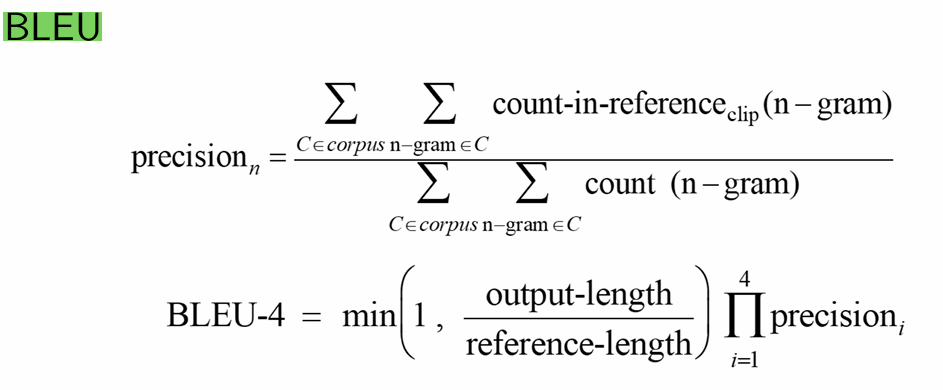

# Construction & Chinese-to-English Machine Translation


## Task introduction:

1. #### **Dataset**

   Description: 

   ​	The compressed package contains 4 jsonl files corresponding to the small training set, large training set, validation set, and test set, with sizes of 10k, 100k, 500, and 200, respectively.  I use both 10k for searching the influence of different method, for example: Xavier-initialization & the Kai-ming-initialization. And for the bigger dataset, I use it for reaching the best performance on BLEU.

   ​	Each line in the jsonl file contains a parallel corpus sample. The model's performance is evaluated based on the test set results. For a simple example of the original dataset:

   ```json
   {"en": "1929 or 1989?", "zh": "1929年还是1989年?", "index": 0}
   ```

   

2. #### **Data Preprocessing**

   Data Cleaning: 

   ​	Filter illegal characters and rare words; filter or truncate overly long sentences.

   Tokenization: 

   ​	Split input sentences into tokens, where each substring has a relatively complete semantic meaning, facilitating learning embedding representation.

   ​	**In fact, I combine these two steps together into a function called "clean_and_truncate_data". For more detail, you may read the interpretation in the "Key code" sector.**

   

   **For processing English**: 

   ​	Natural separators (spaces, punctuation) between words can be directly utilized for tokenization using methods like NLTK, BPE, or WordPiece.

   **But when we are dealing with Chinese**:

   ​	Thing changes quite significant. Since Chinese is quite another language system in comparison to English, we shall use tokenization tools such as Jieba (lightweight) or HanLP (large-scale but effective) to correctly process the Chinese sentences.

   ​	**In the project, I chose NTLK for processing English and JIEBA for processing Chinese**

   

   Vocabulary Construction: 

   ​	Build a statistical vocabulary using the tokenized results, filtering out words with low frequency to prevent the vocabulary size from being too large. It is recommended to initialize with pre-trained word vectors and allow updating during training.

   ​	The most annoying part of building the vocab must be to carefully cope with special tokens, that is ['<unk>', '<pad>', '<bos>', '<eos>']. You have to be quite concentrated to not reach out the static range of the dictionary.

   ​	There are some more specific steps, such as converting the tokens into indices.

   ​	Moreover, the assignment advises us to initialize with pre-trained word vectors and allow updating during training. I have tried to use the "glove.6B.50d", but there has some bugs with coping with the vocabulary range, so even if the function I created is called "build_vocab_and_embeddings" , actually there is no embeddings. Maybe I will try adding it in the second version of the project, if there will be one. (

   

3. #### **Neural Machine Translation Model**

   ​	As requirement, I build a Seq2Seq model based on GNU which has 2 layers for both encoder and decoder. The model is unidirectional. I also implement the attention mechanism. The assignment also encourage us to explore the impact of different alignment functions in the attention mechanism (dot product, multiplicative, additive). So I conduct dot, general and con-cat attention mechanism. You may have a clear view in the "key code" part.

   

4. #### **Training and Inference**

   ​	We are supposed to define the loss function (e.g., cross-entropy loss) and optimizer (e.g., Adam). Particularly, I compare the result for cross-entropy loss  and the LabelSmoothingLoss, the latter has a giant improvement on the BLEU score.

   ​	As for the optimizer, I have tried Adam , the normal Adam W and the one with weight_decay, the last one makes great impact on the score.

   

   ​	The final goal is to process the bilingual parallel corpus into Chinese-to-English data and train the model's Chinese-to-English translation capability. We are also recommended to compare the effects of Teacher Forcing and Free Running strategies. For this part,  I set parameter teacher_forcing_ratio which represents "free-running" when it equals to zero, and when it is one,  it means always using teacher-forcing. In the training, I initialize the parameter to 0.75 and gradually multiple it 0.99^(epoch_number) until it reaches 0.1. I suppose this action would result a more  reliable and effective training as the training would begin with much teaching-force and gradually depend on itself.

   

   ​	We also shall implement the greedy and beam-search decoding strategies. But I have some problems  when implementing the beam-search and still not solve yet. So all the decoding strategy I used below is the greedy strategy. I will try my best to finish the beam-search if I have spare time. (

   

   ​	**! After a long and comfortable siesta, I accomplished the beam-search, the problem was a miss returning value...**

   

5. #### **Programming Language and Environment**

   Programming Language: Python

   Deep Learning Framework: PyTorch

   

6. #### **Evaluation Metric**

   

## Key code:

For the whole code construction, I design four main file:

1. data_preprocess.py

2. model.py 

3. train.py:  not only the training process, but also the evaluation.
4. visualize.py 
5. find.py : finding the appropriate length for truncating the original datasets.
6. back_translation.py: pretend to do some data augmentation by back translation. When examining, found it not critical to the result.


Next, I will collect some key code from the python file above and make explanation of it.


**let' s begin with the BACK_TRANSLATION:**

In the beginning, I used MarianMT as the model and the tokenizer, but in a brief scan, I supposed it' s not powerful enough. What about a more powerful translator? GPT-3 should be great, but it may be too luxury just for data argumentation. Then I attempted to use T5, but unfortunately there are no specific T5 model checkpoint for Chinese-to-English translation. Next I have a try on Mbart from hugging-face.

But whatever the model we are using, we should notice the importance of  synchronization for concurrency.


```python
# 回译（back-translation）: 将原始句子翻译成目标语言，然后再翻译回源语言，从而生成新的训练数据。


# 加载了两个 MarianMT 模型和分词器，一个用于从中文翻译到英文，另一个用于从英文翻译到中文
def load_marian_models():
    tokenizer_zh_en = MarianTokenizer.from_pretrained('Helsinki-NLP/opus-mt-zh-en')
    model_zh_en = MarianMTModel.from_pretrained('Helsinki-NLP/opus-mt-zh-en')
    
    tokenizer_en_zh = MarianTokenizer.from_pretrained('Helsinki-NLP/opus-mt-en-zh')
    model_en_zh = MarianMTModel.from_pretrained('Helsinki-NLP/opus-mt-en-zh')
    
    return tokenizer_zh_en, model_zh_en, tokenizer_en_zh, model_en_zh

# 使用指定的分词器和模型对输入文本翻译
def translate(texts, tokenizer, model):
    encoded = tokenizer(texts, return_tensors='pt', padding=True, truncation=True)
    translated = model.generate(**encoded)
    translated_texts = [tokenizer.decode(t, skip_special_tokens=True) for t in translated]
    return translated_texts

# 首先将中文句子翻译成英文，然后将翻译后的英文再翻译回中文，生成新的中文句子
def back_translate_sentence(sentence, tokenizer_zh_en, model_zh_en, tokenizer_en_zh, model_en_zh):
    en_trans = translate([sentence], tokenizer_zh_en, model_zh_en)[0]
    zh_back = translate([en_trans], tokenizer_en_zh, model_en_zh)[0]
    return zh_back

# 多线程并行处理整个数据集的回译任务，将每个中文句子回译成新的中文句子
def back_translation(data, tokenizer_zh_en, model_zh_en, tokenizer_en_zh, model_en_zh, max_workers=10):
    sentences = [item['zh'] for item in data]
    augmented_data = []

    with concurrent.futures.ThreadPoolExecutor(max_workers=max_workers) as executor:
        futures = [
            executor.submit(back_translate_sentence, sentence, tokenizer_zh_en, model_zh_en, tokenizer_en_zh, model_en_zh)
            for sentence in sentences
        ]
        for future, item in zip(concurrent.futures.as_completed(futures), data):
            zh_back = future.result()
            # 结果中保持原始的英文和新的中文句子的映射
            augmented_data.append({'en': item['en'], 'zh': zh_back, 'index': item['index']})

            # 打印一些示例
            print(f"Original: {item['zh']}")
            print(f"Back Translated: {zh_back}")
            print(f"English: {item['en']}\n")
    
    return augmented_data

```

```python
# the Mbart 
def load_mbart_models():
    tokenizer = MBart50Tokenizer.from_pretrained('facebook/mbart-large-50-many-to-many-mmt')
    model = MBartForConditionalGeneration.from_pretrained('facebook/mbart-large-50-many-to-many-mmt')
    return tokenizer, model

def translate(texts, tokenizer, model, src_lang, tgt_lang):
    tokenizer.src_lang = src_lang
    encoded = tokenizer(texts, return_tensors='pt', padding=True, truncation=True)
    generated_tokens = model.generate(**encoded, forced_bos_token_id=tokenizer.lang_code_to_id[tgt_lang])
    translated_texts = [tokenizer.decode(t, skip_special_tokens=True) for t in generated_tokens]
    return translated_texts

def back_translate_sentence(sentence, tokenizer, model):
    en_trans = translate([sentence], tokenizer, model, 'zh_CN', 'en_XX')[0]
    zh_back = translate([en_trans], tokenizer, model, 'en_XX', 'zh_CN')[0]
    return zh_back

def back_translation(data, tokenizer, model, max_workers=10):
    sentences = [item['zh'] for item in data]
    augmented_data = [None] * len(data)

    with concurrent.futures.ThreadPoolExecutor(max_workers=max_workers) as executor:
        futures = {
            executor.submit(back_translate_sentence, sentence, tokenizer, model): idx
            for idx, sentence in enumerate(sentences)
        }
        for future in concurrent.futures.as_completed(futures):
            idx = futures[future]
            zh_back = future.result()
            if zh_back is not None:
                augmented_data[idx] = {'en': data[idx]['en'], 'zh': zh_back, 'index': data[idx]['index']}
                print(f"Original: {data[idx]['zh']}")
                print(f"Back Translated: {zh_back}")
                print(f"English: {data[idx]['en']}\n")
    
    augmented_data = [item for item in augmented_data if item is not None]
    return augmented_data
```

But both these two function above is using the CPU for back_translation, and the time consuming is unbearable. So for true practical function, we have to use gpu cuda to accelerate the procession. 

Limited by the gpu memory, we have to carefully choose the batch_size & the max_workers. Intuitively, I started examining different pair in consideration for both feasibility and speed. After a few experiments, I decide to use (6,6). It costs about 1 second on average for one batch (=6). Arithmetically, it will take no more than 30 minutes which is quite bearable.


However, nearly 30 minutes endeavoring back-translation doesn't improve that much which equals to the effort that had been made. In a word, improving no more than 0.5, in an other word, 2% better than training on the original train_10k dataset.


```python
def translate(texts, tokenizer, model, src_lang, tgt_lang, device, max_length=512):
    tokenizer.src_lang = src_lang
    encoded = tokenizer(texts, return_tensors='pt', padding=True, truncation=True, max_length=max_length).to(device)
    generated_tokens = model.generate(**encoded, forced_bos_token_id=tokenizer.lang_code_to_id[tgt_lang])
    translated_texts = [tokenizer.decode(t, skip_special_tokens=True) for t in generated_tokens]
    return translated_texts

def back_translate(sentences, tokenizer, model, device, max_length=512):
    start_time = time.time()
    # Translate to English and then back to Chinese
    en_trans = translate(sentences, tokenizer, model, 'zh_CN', 'en_XX', device, max_length)
    zh_back = translate(en_trans, tokenizer, model, 'en_XX', 'zh_CN', device, max_length)
    end_time = time.time()
    elapsed_time = end_time - start_time
    print(f"Time taken to back-translate batch: {elapsed_time:.2f} seconds")
    return zh_back

def back_translation(data, tokenizer, model, device, batch_size=6, max_workers=6):
    sentences = [item['zh'] for item in data]
    augmented_data = []

    with concurrent.futures.ThreadPoolExecutor(max_workers=max_workers) as executor:
        futures = []
        for i in range(0, len(sentences), batch_size):
            batch = sentences[i:i+batch_size]
            futures.append(executor.submit(back_translate, batch, tokenizer, model, device))
        
        for future in concurrent.futures.as_completed(futures):
            try:
                zh_back_batch = future.result()
                for j, zh_back in enumerate(zh_back_batch):
                    idx = (futures.index(future) * batch_size) + j
                    augmented_data.append({'en': data[idx]['en'], 'zh': zh_back, 'index': data[idx]['index']})
                    # print(f"Original: {data[idx]['zh']}")
                    # print(f"Back Translated: {zh_back}")
                    # print(f"English: {data[idx]['en']}\n")
            except Exception as e:
                print(f"Error processing batch: {str(e)}")
            finally:
                # 清理 GPU 内存缓存和变量
                torch.cuda.empty_cache()
                gc.collect()

    return augmented_data
```


**And then comes a simple file to find the appropriate truncating length for both English and Chinese.** I searched for the train_100k dataset and find the 95% length of en & zh sentences. The result is showing below:


**Next we may take a close look at the data-pre-process:**

```python
# 数据清洗和截断
def clean_and_truncate_data(data, max_len_en=41, max_len_zh=48):
    cleaned_data = []
    for item in data:
        en_tokens = nltk.word_tokenize(item['en'])
        zh_tokens = list(jieba.cut(item['zh']))
        
        if len(en_tokens) > max_len_en - 2:  # 减去特殊标记长度
            en_tokens = en_tokens[:max_len_en - 2]
        
        if len(zh_tokens) > max_len_zh - 2:  # 减去特殊标记长度
            zh_tokens = zh_tokens[:max_len_zh - 2]
        
        cleaned_data.append({'en': en_tokens, 'zh': zh_tokens, 'index': item['index']})
    return cleaned_data

def load_glove_embeddings(glove_path, vocab, embedding_dim=50):
    embeddings = np.random.uniform(-0.25, 0.25, (len(vocab), embedding_dim))
    word_index = {word: idx for idx, word in enumerate(vocab.keys())}

    with open(glove_path, 'r', encoding='utf-8') as f:
        for line in f:
            values = line.split()
            word = values[0]
            vector = np.array(values[1:], dtype='float32')
            if word in word_index:
                embeddings[word_index[word]] = vector
    
    return torch.tensor(embeddings, dtype=torch.float32)


# 分词（已在clean_and_truncate_data中完成）
def tokenize(data):
    return data

# 构建词典
def build_vocab_and_embeddings(tokenized_data, min_freq=1, max_size=1000000):
    counter_en = Counter()
    counter_zh = Counter()
    for item in tokenized_data:
        counter_en.update(item['en'])
        counter_zh.update(item['zh'])

    specials = ['<unk>', '<pad>', '<bos>', '<eos>']
    vocab_en = {special: idx for idx, special in enumerate(specials)}
    vocab_zh = {special: idx for idx, special in enumerate(specials)}

    max_size_en = max_size - len(vocab_en)
    max_size_zh = max_size - len(vocab_zh)

    for word, freq in counter_en.items():
        if freq >= min_freq and word not in vocab_en:
            vocab_en[word] = len(vocab_en)
        if len(vocab_en) >= max_size_en:
            break

    for word, freq in counter_zh.items():
        if freq >= min_freq and word not in vocab_zh:
            vocab_zh[word] = len(vocab_zh)
        if len(vocab_zh) >= max_size_zh:
            break

    # embeddings_en = np.zeros((len(vocab_en), embedding_dim))
    # with open(glove_path, 'r', encoding='utf-8') as f:
    #     for line in f:
    #         values = line.split()
    #         word = values[0]
    #         vector = np.array(values[1:], dtype='float32')
    #         if word in vocab_en:
    #             embeddings_en[vocab_en[word]] = vector

    print(f"Vocabulary size (English): {len(vocab_en)}")
    print(f"Vocabulary size (Chinese): {len(vocab_zh)}")

    return vocab_en, vocab_zh


# 转换为索引
def convert_to_indices(data, vocab_en, vocab_zh):
    UNK_IDX_EN = vocab_en['<unk>']
    UNK_IDX_ZH = vocab_zh['<unk>']
    
    indexed_data = []
    for item in data:
        if not isinstance(item['en'], list) or not isinstance(item['zh'], list):
            raise ValueError(f"Expected list type for 'en' and 'zh' fields, but got {type(item['en'])} and {type(item['zh'])}")

        indexed_item = {
            'en': [vocab_en.get(token, UNK_IDX_EN) for token in ['<bos>'] + item['en'] + ['<eos>']],
            'zh': [vocab_zh.get(token, UNK_IDX_ZH) for token in ['<bos>'] + item['zh'] + ['<eos>']],
            'index': item['index']
        }

        # Debug
        for idx in indexed_item['zh']:
            if idx >= len(vocab_zh) or idx < 0:
                print(f"Error in Chinese sentence: {item['zh']}")
                raise ValueError(f"Index {idx} out of range for vocab size {len(vocab_zh)} in Chinese sentence {item['zh']}")
        for idx in indexed_item['en']:
            if idx >= len(vocab_en) or idx < 0:
                print(f"Error in English sentence: {item['en']}")
                raise ValueError(f"Index {idx} out of range for vocab size {len(vocab_en)} in English sentence {item['en']}")

        indexed_data.append(indexed_item)
    return indexed_data
```


**There comes the MODEL sector !** Maybe the code of everything. But subject to the requirement "a Seq2Seq model based on GNU which has 2 layers for both encoder and decoder. The model is unidirectional. I also implement the attention mechanism." The complexity of the model has already been decided.


**Rather than just giving the code, I will give some explanation first.**

First come the attention mechanism, including Dot production, General and the Con-cat.

For the dot production, we extend 'hidden' to the same length of 'encoder_output' and dot them by element, then sum the result.
$$
score(h_t,h_s)=h_t⋅h_s
$$
As for General Attention, we first use linear layer 'self.attn' to process 'encoder_output' then do the same procession as dot production
$$
score(h_t,h_s)=h_t⋅W_a⋅h_s
$$
At last, the con-cat attention require us to con-cat 'hidden' with 'encoder_output' and do the general attention.
$$
score(h_t,h_s)=v_a ⋅tanh(W_a⋅[h_t;h_s])
$$


So who is the best? From testing different attention mechanism, I reckon that the dot has the fastest training speed which is quite suitable for small model. This sounds really intuitive since it's the easiest.

As the complexity grows, the lower speed and better performance it is. Really reasonable.

```python

# Attention Mechanism
class Attention(nn.Module):
    def __init__(self, hidden_size, method="dot"):
        super(Attention, self).__init__()
        self.hidden_size = hidden_size
        self.method = method

        # 初始化一个线性层 self.attn 
        if method == "general":
            self.attn = nn.Linear(hidden_size, hidden_size)

        # 多初始化一个参数向量 self.v
        elif method == "concat":
            self.attn = nn.Linear(hidden_size * 2, hidden_size)
            self.v = nn.Parameter(torch.rand(hidden_size))

    def dot_score(self, hidden, encoder_output):
        # 确保 hidden 的维度是 [batch_size, 1, hidden_size]
        if hidden.dim() == 2:
            hidden = hidden.unsqueeze(1)
        
        # 扩展 hidden 到 encoder_output 的序列长度
        hidden = hidden.expand(-1, encoder_output.size(1), -1)
        
        return torch.sum(hidden * encoder_output, dim=2)


    def general_score(self, hidden, encoder_output):
        energy = self.attn(encoder_output)
        return torch.sum(hidden * energy, dim=2)

    def concat_score(self, hidden, encoder_output):
            
            batch_size = encoder_output.size(0)
            seq_len = encoder_output.size(1)
            
            # 确保 hidden 维度为 [batch_size, hidden_size]
            if hidden.dim() == 3:  # 当 hidden 是 [num_layers, batch_size, hidden_size]
                hidden = hidden[-1]  # 只取最后一层的隐藏状态
            
            hidden_size = hidden.size(1)
            
            # 将 hidden 从 [batch_size, hidden_size] 扩展到 [batch_size, seq_len, hidden_size]
            hidden = hidden.unsqueeze(1).expand(batch_size, seq_len, hidden_size)

            # 拼接 hidden 和 encoder_output
            concatenated = torch.cat((hidden, encoder_output), 2)

            # 通过全连接层计算注意力能量
            energy = self.attn(concatenated).tanh()

            # 计算最终的注意力分数
            attn_energies = torch.sum(self.v * energy, dim=2)

            return attn_energies


    def forward(self, hidden, encoder_outputs):

        hidden = hidden.unsqueeze(1)  # [batch_size, 1, hidden_size]

        # dot product
        if self.method == "dot":
            attn_energies = self.dot_score(hidden, encoder_outputs)
        # multiplicative
        elif self.method == "general":
            attn_energies = self.general_score(hidden, encoder_outputs)
        # additive
        elif self.method == "concat":
            hidden = hidden[-1]  # 只取最后一层的隐藏状态
            attn_energies = self.concat_score(hidden, encoder_outputs)
        
        # softmax 函数计算注意力权重
        attn_weights = F.softmax(attn_energies, dim=1)
        # torch.bmm: 批量矩阵乘法，用注意力权重与编码器输出相乘得到上下文向量
        context = torch.bmm(attn_weights.unsqueeze(1), encoder_outputs)
        return context, attn_weights
  
```


```python
# Encoder
class EncoderRNN(nn.Module):
    def __init__(self, input_size, hidden_size, n_layers=2, dropout_p=0.1, embeddings=None):
        '''
            input_size: 输入词汇表的大小，输入序列中可能出现的不同词汇的数量。
            hidden_size: GRU的隐藏层大小,每个GRU单元的输出向量的维度。
            n_layers: GRU的层数。
            dropout_p: Dropout的概率,防止过拟合。
            embeddings: 预训练的嵌入层，如果提供则使用，否则创建一个新的嵌入层
        '''
        super(EncoderRNN, self).__init__()
        self.hidden_size = hidden_size
        self.n_layers = n_layers

        if embeddings is not None:
            self.embedding = nn.Embedding.from_pretrained(embeddings)
        else:
            self.embedding = nn.Embedding(input_size, hidden_size)

        self.gru = nn.GRU(hidden_size, hidden_size, n_layers, dropout=dropout_p, batch_first=True)
        self.dropout = nn.Dropout(dropout_p)

    def forward(self, input):
        '''
            输入：形状为 [batch_size, seq_len] 的张量(batch_size 是一个批次中的序列数量, seq_len 是每个序列的长度)
            self.embedding(input)：将输入序列中的词汇索引转换为对应的嵌入向量。输出形状为 [batch_size, seq_len, hidden_size]。
            self.dropout(embedded):嵌入向量上应用dropout。
            self.gru(embedded):将嵌入向量传递给GRU层。
            output:形状为 [batch_size, seq_len, hidden_size]，表示每个时间步的输出。
            hidden:形状为 [n_layers, batch_size, hidden_size]，表示每一层最后一个时间步的隐藏状态。
        '''
        if input.max().item() >= self.embedding.num_embeddings:
            raise ValueError(f"Input index {input.max().item()} is out of range for embedding size {self.embedding.num_embeddings}")
        # Embedding & dropout layer
        embedded = self.dropout(self.embedding(input))
        # GRU layer
        output, hidden = self.gru(embedded)
        return output, hidden

```


```python
# Decoder
class AttnDecoderRNN(nn.Module):
    def __init__(self, hidden_size, output_size, attn_model='dot', n_layers=2, dropout_p=0.1, embeddings=None):
        # 参数含义类似encoder
        super(AttnDecoderRNN, self).__init__()
        self.hidden_size = hidden_size
        self.output_size = output_size
        self.attn_model = attn_model
        self.n_layers = n_layers
        self.dropout_p = dropout_p

        # unsupportive for embedding yet
        if embeddings is not None:
            self.embedding = nn.Embedding.from_pretrained(embeddings)
        else:
            self.embedding = nn.Embedding(output_size, hidden_size)

        self.dropout = nn.Dropout(self.dropout_p)
        self.attention = Attention(self.hidden_size, method=attn_model)
        self.gru = nn.GRU(self.hidden_size * 2, self.hidden_size, n_layers, dropout=self.dropout_p, batch_first=True)
        self.out = nn.Linear(self.hidden_size, self.output_size)

    def forward(self, input, last_hidden, encoder_outputs):
        '''
        输入：
            input: 当前时间步的输入，形状为 [batch_size]。
            last_hidden: 上一个时间步的隐藏状态，形状为 [n_layers, batch_size, hidden_size]。
            encoder_outputs: 编码器的所有输出，形状为 [batch_size, seq_len, hidden_size]。
        输出：
            output:形状为 [batch_size, output_size]，表示当前时间步的预测输出。
            hidden: 形状为 [n_layers, batch_size, hidden_size], 表示GRU的隐藏状态。
            attn_weights: 形状为 [batch_size, seq_len]，表示注意力权重。
        '''

        # 嵌入层和dropout层：输入通过嵌入层转换为嵌入向量，通过dropout层得到 embedded，形状为 [batch_size, 1, hidden_size]
        batch_size = input.size(0)
        embedded = self.embedding(input).view(batch_size, 1, -1)
        embedded = self.dropout(embedded)

        # 对于 concat 注意力机制，使用 last_hidden 和 encoder_outputs 计算上下文向量 context 和注意力权重 attn_weights，
        # 并将 context 和 embedded 拼接，作为GRU的输入。
        if self.attn_model == 'concat':
            context, attn_weights = self.attention(last_hidden, encoder_outputs)
            context = context.squeeze(1)
            # CAT
            rnn_input = torch.cat((embedded, context.unsqueeze(1)), 2)
            # GRU
            output, hidden = self.gru(rnn_input, last_hidden)
            # SOFTMAX
            output = F.log_softmax(self.out(output.squeeze(1)), dim=1)

            return output, hidden, attn_weights

        # dot & general attention
        context, attn_weights = self.attention(last_hidden[-1], encoder_outputs)

        context = context.unsqueeze(1)
        context = context.squeeze(2)
        rnn_input = torch.cat((embedded, context), 2)

        output, hidden = self.gru(rnn_input, last_hidden)
        output = F.log_softmax(self.out(output.squeeze(1)), dim=1)
        return output, hidden, attn_weights
```


Finally the whole Seq2Seq, including encoder, decoder, greedy-decoder and beam-search-decoder.

Just as the direct meaning of their name, in greedy-decoder strategy we always choose the best one, and for the beam-search, we preserve chances for more than one candidates. From my paper reading experience, we usually choose top-2 or top-3. So the default value is set as 3.

```python
# Seq2Seq Model
class Seq2SeqModel(nn.Module):
    def __init__(self, encoder, decoder, device):
        super(Seq2SeqModel, self).__init__()
        self.encoder = encoder
        self.decoder = decoder
        self.device = device

    def forward(self, src, trg, teacher_forcing_ratio=0.5, return_attention=False):
        '''
            src: 输入序列，形状为 [batch_size, src_len]。
            trg: 目标序列，形状为 [batch_size, trg_len]。
            teacher_forcing_ratio: 使用教师强制的比例。1即是完全使用teacher-forcing
            return_attention: 是否返回注意力权重, 主要是用于在visualize中展现attention热图
        '''
        batch_size = src.shape[0]
        max_len = trg.shape[1]
        trg_vocab_size = self.decoder.output_size

        outputs = torch.zeros(batch_size, max_len, trg_vocab_size).to(self.device)
        encoder_outputs, hidden = self.encoder(src)

        input = trg[:, 0]

        attentions = torch.zeros(batch_size, max_len - 1, src.shape[1]).to(self.device) if return_attention else None

        for t in range(1, max_len):
            output, hidden, attention = self.decoder(input, hidden, encoder_outputs)
            outputs[:, t] = output
            if return_attention:
                attentions[:, t - 1] = attention
            teacher_force = random.random() < teacher_forcing_ratio
            input = trg[:, t] if teacher_force else output.argmax(1)

        if return_attention:
            return outputs, attentions
        else:
            return outputs
        
    def greedy_decode_bleu(self, src, max_len, sos_token=SOS_token, eos_token=EOS_token):
        '''
            src: 输入序列。
            max_len: 目标序列的最大长度。
            sos_token: 开始符号的索引。
            eos_token: 结束符号的索引。
        '''
        batch_size = src.shape[0]

        # 存储每一步的输出索引
        outputs = torch.zeros(batch_size, max_len).to(self.device).long()
        encoder_outputs, hidden = self.encoder(src)

        input = torch.tensor([sos_token] * batch_size).to(self.device).long()

        for t in range(max_len):
            output, hidden, _ = self.decoder(input, hidden, encoder_outputs)
            top1 = output.argmax(1)  # 获取最大概率的索引
            outputs[:, t] = top1
            input = top1
            if (top1 == eos_token).all():
                break

        return outputs

    def greedy_decode(self, src, max_len, sos_token=SOS_token, eos_token=EOS_token):
        # 相比于bleu版本的，这里返回的是每个时间步的完整输出概率分布，而不是最大概率的索引。
        batch_size = src.shape[0]
        trg_vocab_size = self.decoder.output_size

        outputs = torch.zeros(batch_size, max_len, trg_vocab_size).to(self.device)
        encoder_outputs, hidden = self.encoder(src)

        input = torch.tensor([sos_token] * batch_size).to(self.device)

        for t in range(1, max_len):
            output, hidden, _ = self.decoder(input, hidden, encoder_outputs)
            outputs[:, t] = output
            top1 = output.argmax(1)
            input = top1
            if (top1 == eos_token).all():
                break

        return outputs
    
    def beam_search_decode(self, src, max_len, sos_token=SOS_token, eos_token=EOS_token, beam_width=3):
        batch_size = src.size(0)
        trg_vocab_size = self.decoder.output_size
        encoder_outputs, hidden = self.encoder(src)

        # 初始化概率张量
        log_probs_all = torch.zeros(batch_size, max_len, trg_vocab_size).to(self.device)

        # 初始化beam
        beams = [[(torch.LongTensor([sos_token]).to(self.device), hidden[:, i, :].unsqueeze(1).contiguous(), 0, False)] for i in range(batch_size)]
        completed_beams = [[] for _ in range(batch_size)]

        for step in range(max_len):
            # 初始化候选序列：每个时间步保留 beam_width 数量的候选序列
            all_candidates = []
            for i in range(batch_size):
                candidates = []
                for seq, hidden, score, finished in beams[i]:
                    if finished:
                        completed_beams[i].append((seq, hidden, score, finished))
                        continue
                    
                    # 调用解码器：获取当前时间步的输出和隐藏状态。
                    output, hidden, _ = self.decoder(seq[-1].view(1, -1), hidden.contiguous(), encoder_outputs[i].unsqueeze(0).contiguous())
                    log_probs = F.log_softmax(output, dim=1).squeeze(0)
                    top_log_probs, top_indices = log_probs.topk(beam_width)

                    # 收集对数概率
                    log_probs_all[i, step, :] = log_probs

                    for k in range(beam_width):
                        new_seq = torch.cat([seq, top_indices[k].view(1).to(self.device)])
                        new_score = score + top_log_probs[k].item()
                        new_finished = top_indices[k].item() == eos_token
                        candidates.append((new_seq, hidden, new_score, new_finished))

                # 选择最佳候选：选择得分最高的 beam_width 数量的候选序列。
                candidates = sorted(candidates, key=lambda x: x[2], reverse=True)[:beam_width]
                beams[i] = candidates
                all_candidates.extend(candidates)

            if all([len(b) == 0 for b in beams]):
                break

        # 返回所有时间步的对数概率
        return log_probs_all

```


**Another really critic section: the training and evaluation part.**

At the beginning of the training, I mis-arrange the input  order and train the model ability of English-to-Chinese but evaluate the capacity of Chinese-to-English. So in quite a long time, I tried every ideas in my mind to save the poor bleu score. And then I discovered the wrong order of input. Thought this meant to re-training the model for more than 1 hour, it do make sense, making outstanding improvement on performance.

```python
# teacher_forcing_ratio=1表示总是使用 teacher_forcing，=0表示总是使用 Free Running
def train_model(model, train_loader, criterion, optimizer, device, teacher_forcing_ratio=0.5):
    model.train()
    total_loss = 0
    for src, trg in train_loader:
        src = src.to(device)
        trg = trg.to(device)

        optimizer.zero_grad()
        output = model(src, trg, teacher_forcing_ratio=teacher_forcing_ratio)

        output = output[:, 1:].contiguous()
        trg = trg[:, 1:].contiguous()

        output = output.view(-1, output.shape[-1]).float()  # [batch_size * seq_len, vocab_size]
        trg = trg.view(-1)  # [batch_size * seq_len]

        loss = criterion(output, trg)
        loss.backward()

        optimizer.step()
        total_loss += loss.item()

    return total_loss / len(train_loader)


# torch.backends.cudnn.enabled = False
# import os
# os.environ['CUDA_LAUNCH_BLOCKING'] = '1'

def evaluate_model_greedy(model, valid_loader, criterion, device, sos_token=SOS_token, eos_token=EOS_token):
    model.eval()
    total_loss = 0
    with torch.no_grad():
        for src, trg in valid_loader:
            src = src.to(device)
            trg = trg.to(device)
            output = model.greedy_decode(src, max_len=trg.shape[1], sos_token=sos_token, eos_token=eos_token)
            # Output shape: (batch_size, max_len, output_dim)
            # Trg shape: (batch_size, max_len)
            output = output[:, 1:].contiguous().view(-1, output.shape[-1])
            trg = trg[:, 1:].contiguous().view(-1)

            # Ensure correct data types
            output = output.float()
            trg = trg.long()
            
            loss = criterion(output, trg)
            total_loss += loss.item()

    return total_loss / len(valid_loader)

def evaluate_model_beam_search(model, valid_loader, criterion, device, beam_width=3):
    model.eval()
    total_loss = 0
    with torch.no_grad():
        for src, trg in valid_loader:
            src = src.to(device)
            trg = trg.to(device)

            output = model.beam_search_decode(src, max_len=trg.shape[1], sos_token=SOS_token, eos_token=EOS_token, beam_width=beam_width)

            # print(f"output shape before reshape: {output.shape}")
            # print(f"trg shape after slicing: {trg.shape}")

            # slicing to match the lengths
            output = output[:, 1:].contiguous()
            trg = trg[:, 1:].contiguous()

            # print(f"output shape after slicing: {output.shape}")
            # print(f"trg shape after slicing: {trg.shape}")

            # Ensure output is of type float for log_softmax and loss calculation
            output = output.view(-1, output.size(-1)).float()
            trg = trg.view(-1).long()

            # print(f"output shape after reshape: {output.shape}")
            # print(f"trg shape after reshape: {trg.shape}")

            if output.size(0) != trg.size(0):
                print(f"Shape mismatch after reshape: output {output.shape}, trg {trg.shape}")
                continue

            # # Print some example values
            # print(f"output example values: {output[:5]}")
            # print(f"trg example values: {trg[:5]}")

            loss = criterion(output, trg)
            print(f"loss: {loss.item()}")  # Print the loss for each batch

            total_loss += loss.item()

    return total_loss / len(valid_loader)


def build_itos(vocab):
    itos = {index: token for token, index in vocab.items()}
    return itos

def evaluate_model_bleu(model, valid_loader, device, itos_en):
    model.eval()
    references = []
    hypotheses = []
    with torch.no_grad():
        for src, trg in valid_loader:
            src = src.to(device)
            trg = trg.to(device)

            output = model.greedy_decode_bleu(src, max_len=trg.shape[1], sos_token=SOS_token, eos_token=EOS_token)

            trg_words = [[itos_en[token] for token in sent if token in itos_en and token != 1] for sent in trg.cpu().numpy()]
            output_words = [[itos_en[token] for token in sent if token in itos_en and token != 1] for sent in output.cpu().numpy()]

            references.extend([[ref] for ref in trg_words])  # 双层列表
            hypotheses.extend(output_words)

    cc = SmoothingFunction()
    bleu_score = corpus_bleu(references, hypotheses, smoothing_function=cc.method1)
    return bleu_score * 100

# loss function
class LabelSmoothingLoss(nn.Module):
    def __init__(self, classes, smoothing=0.1, dim=-1):
        super(LabelSmoothingLoss, self).__init__()
        self.confidence = 1.0 - smoothing
        self.smoothing = smoothing
        self.cls = classes
        self.dim = dim

    def forward(self, pred, target):
        pred = pred.log_softmax(dim=self.dim)
        with torch.no_grad():
            true_dist = torch.zeros_like(pred)
            true_dist.fill_(self.smoothing / (self.cls - 1))
            true_dist.scatter_(1, target.data.unsqueeze(1), self.confidence)
            true_dist += self.smoothing / self.cls
        return torch.mean(torch.sum(-true_dist * pred, dim=self.dim))
```


**And in the main function,**  I try various strategy to improve performance on BLEU score, considering and testing :

1. different hyper-parameters( the hidden_size & batch_size need to be adjusted when using the train_100k dataset subject to the gpu memory), 

2. greedy & beam-search decoder strategy( after testing, little impact on score), 

3. back-translation or not ( also slight impact on bigger dataset, although make inspiring improvement on smaller ones), 

4. various attention mechanism (dot , general and con-cat). 

5. Moreover, I have surveyed on Xavier initialization and Kai ming initialization. 

6. I also try different loss function( CrossEntropyLoss & LabelSmoothingLoss)
7. The choice of optimizer & scheduler cannot be ignored, first I select Adam as the optimizer since we use it a lot, but not really well-performed, next I tried Adam W and put weight_decay (  1 e-5 ) on it. As for scheduler, ReduceLROnPlateau, StepLR and CosineAnnealingLR have been considered. At last, I decide to use CosineAnnealingLR with T_max equals to 10.
8. I also give a gradually descent of the teaching-force-ration which is set 0.75 at the beginning. As the training processes, it will gradually reduce to 0.1.
9. A early stop is also implemented. I am not a very patient guy (

```python
   
def main():
    device = torch.device("cuda" if torch.cuda.is_available() else "cpu")

    # 加载预处理后的数据
    data_path = 'preprocessed_data.pth'
    train_data, valid_data, test_data, vocab_en, vocab_zh = torch.load(data_path)

    # 超参数
    input_size = len(vocab_zh)  # 注意这里是中文词汇表的大小
    output_size = len(vocab_en)  # 这里是英文词汇表的大小
    hidden_size = 512
    n_layers = 2
    dropout_p = 0.3
    batch_size = 64
    learning_rate = 0.001
    num_epochs = 300
    patience = 7
    decode_strategy = 'greedy'
    beam_width = 3

    # 加载数据
    train_dataset = TranslationDataset(train_data)
    valid_dataset = TranslationDataset(valid_data)
    test_dataset = TranslationDataset(test_data)

    train_loader = DataLoader(train_dataset, batch_size=batch_size, shuffle=True, collate_fn=collate_fn)
    valid_loader = DataLoader(valid_dataset, batch_size=batch_size, shuffle=False, collate_fn=collate_fn)
    test_loader = DataLoader(test_dataset, batch_size=batch_size, shuffle=False, collate_fn=collate_fn)

    # 初始化模型、损失函数和优化器
    encoder = EncoderRNN(input_size, hidden_size, n_layers, dropout_p).to(device)
    decoder = AttnDecoderRNN(hidden_size, output_size, attn_model='concat', n_layers=n_layers, dropout_p=dropout_p).to(device)
    model = Seq2SeqModel(encoder, decoder, device).to(device)

    # Xavier初始化的目的是让输入和输出的方差相同，以防止信号在前向传播中逐层放大或消失，主要用于激活函数为sigmoid或tanh的神经网络
    # def init_weights(m):
    #     for name, param in m.named_parameters():
    #         if 'weight' in name and 'embedding' not in name:
    #             nn.init.xavier_uniform_(param.data)
    #         elif 'bias' in name:
    #             nn.init.constant_(param.data, 0)

    # Kaiming初始化的目的是使前向传播时各层的输出具有适当的方差，特别适用于ReLU及其变体激活函数
    def init_weights(m):
        for name, param in m.named_parameters():
            if 'weight' in name and 'embedding' not in name:
                nn.init.kaiming_uniform_(param.data)  # 使用Kaiming初始化
            elif 'bias' in name:
                nn.init.constant_(param.data, 0)

    encoder.apply(init_weights)
    decoder.apply(init_weights)

    # criterion = nn.CrossEntropyLoss(ignore_index=vocab_en['<unk>']) # 0
    criterion = LabelSmoothingLoss(classes=output_size, smoothing=0.1) # 1

    # optimizer = optim.AdamW(model.parameters(), lr=learning_rate) # 2
    optimizer = optim.AdamW(model.parameters(), lr=learning_rate, weight_decay=1e-5) # 3

    # scheduler = optim.lr_scheduler.ReduceLROnPlateau(optimizer, 'min', patience=1, factor=0.5) # 4
    # scheduler = optim.lr_scheduler.StepLR(optimizer, step_size=5, gamma=0.5) # 5是学习率保持的批次大小 # 5
    scheduler = optim.lr_scheduler.CosineAnnealingLR(optimizer, T_max=10) # 10是余弦周期 # 6

    best_valid_loss = float('inf')
    best_model_state = None
    epochs_no_improve = 0
    
    for epoch in range(num_epochs):
        start_time = time.time()  # 记录开始时间

        teacher_forcing_ratio = max(0.75 * (0.99 ** epoch), 0.1)  # 初始值设置为 0.75，然后逐步减少到 0.1

        train_loss = train_model(model, train_loader, criterion, optimizer, device, teacher_forcing_ratio)
        
        if (decode_strategy == 'greedy') : 
            valid_loss = evaluate_model_greedy(model, valid_loader, criterion, device)
        elif (decode_strategy == 'beam') :
            valid_loss = evaluate_model_beam_search(model, valid_loader, criterion, device, beam_width)
        else :
            print ("Unsupported decode strategy")

        end_time = time.time()  # 记录结束时间
        epoch_mins, epoch_secs = divmod(end_time - start_time, 60)  # 计算耗时

        print(f'Time cost {epoch_mins} mins {epoch_secs:.3f} secs.')
        print(f'Epoch {epoch+1}, Train Loss: {train_loss:.4f}, Valid Loss: {valid_loss:.4f}')
        print(f'Learning Rate: {scheduler.get_last_lr()}')  # 打印当前学习率

        if valid_loss < best_valid_loss:
            best_valid_loss = valid_loss
            best_model_state = model.state_dict()
            epochs_no_improve = 0
        else:
            epochs_no_improve += 1

        # scheduler.step(valid_loss) # 和ReduceLROnPlateau.step方法绑定
        scheduler.step()

        if epochs_no_improve >= patience:
            print(f'Early stopping at epoch {epoch+1} due to no improvement in validation loss.')
            break

        torch.cuda.empty_cache()

    if best_model_state is not None:
        model.load_state_dict(best_model_state)
        torch.save(model.state_dict(), 'best_model.pth')
        print('Loaded best model state with validation loss:', best_valid_loss)
        print('Model saved as best_model.pth')

    itos_en = build_itos(vocab_en)
    bleu_score = evaluate_model_bleu(model, test_loader, device, itos_en)
    print(f'BLEU Score: {bleu_score:.4f}')

```


**Finally here comes the visualization part !** In the file, I leverage the trained model and a simple input to make a survey on what exactly the attention looks like.

```python
# 将中文句子转换为拼音, 因为这个系统没有安装中文拼写，这里将要翻译的中文转换成拼音来做图表的x轴
def convert_to_pinyin(sentence):
    pinyin_sentence = pinyin(sentence, style=Style.NORMAL)
    return [word[0] for word in pinyin_sentence]

# 调用训练好的模型来翻译句子并返回注意力
def translate_and_return_attention(model, src_sentence, src_vocab, trg_vocab, device, max_len=50):
    model.eval()
    with torch.no_grad():
        src_indexes = [src_vocab[word] for word in src_sentence]
        src_tensor = torch.tensor(src_indexes).unsqueeze(0).to(device)

        encoder_outputs, hidden = model.encoder(src_tensor)

        trg_indexes = [trg_vocab['<bos>']]
        attentions = torch.zeros(max_len, len(src_indexes)).to(device)

        for i in range(max_len):
            trg_tensor = torch.tensor([trg_indexes[-1]]).to(device)
            with torch.no_grad():
                output, hidden, attention = model.decoder(trg_tensor, hidden, encoder_outputs)
            attentions[i] = attention.squeeze(0)

            pred_token = output.argmax(1).item()
            trg_indexes.append(pred_token)

            if pred_token == trg_vocab['<eos>']:
                break

        trg_tokens = [list(trg_vocab.keys())[list(trg_vocab.values()).index(i)] for i in trg_indexes]
        return trg_tokens[1:], attentions[:len(trg_tokens)-1]

# 可视化注意力机制
def visualize_attention(model, src_sentence, src_vocab, trg_vocab, device, save_path='attention_visualization.png'):
    trg_sentence, attentions = translate_and_return_attention(model, src_sentence, src_vocab, trg_vocab, device)

    src_tokens = convert_to_pinyin(src_sentence)
    trg_tokens = trg_sentence

    fig = plt.figure(figsize=(10, 8))
    ax = fig.add_subplot(111)
    
    cax = ax.matshow(attentions.cpu().numpy(), cmap='viridis')
    
    fig.colorbar(cax)
    
    ax.set_xticks(range(len(src_tokens)))
    ax.set_yticks(range(len(trg_tokens)))
    ax.set_xticklabels(src_tokens, rotation=90)
    ax.set_yticklabels(trg_tokens)
    
    plt.xlabel('Source Sequence')
    plt.ylabel('Target Sequence')
    plt.title('Attention Mechanism Visualization')
    
    plt.savefig(save_path)
```


## Result :


For using the augmented_train based on train_10k and train_10k itself, there is slightly different, in saving of time, we just use the augmented_train dataset as the representative of them. I will still show the difference after data-preprocessing, you may change the training dataset in the data_preprocess.py main function. 


Based on the hyper-parameters below, we will explore the different effect on various strategies

```python
    # 超参数
    input_size = len(vocab_zh)  # 注意这里是中文词汇表的大小
    output_size = len(vocab_en)  # 这里是英文词汇表的大小
    hidden_size = 512
    n_layers = 2
    dropout_p = 0.3
    batch_size = 64
    learning_rate = 0.001
    num_epochs = 300
    patience = 7
    beam_width = 3
    teacher_forcing_ratio = max(0.75 * (0.99 ** epoch), 0.1)  # 初始值设置为 0.75，然后逐步减少到 0.1
```


Since there are really a lot to test, for an apparent view, I number the optimizer and scheduler usage as below:

```python
    # criterion = nn.CrossEntropyLoss(ignore_index=vocab_en['<unk>']) # 0
    criterion = LabelSmoothingLoss(classes=output_size, smoothing=0.1) # 1 

    # optimizer = optim.AdamW(model.parameters(), lr=learning_rate) # 2
    optimizer = optim.AdamW(model.parameters(), lr=learning_rate, weight_decay=1e-5) # 3

    # scheduler = optim.lr_scheduler.ReduceLROnPlateau(optimizer, 'min', patience=1, factor=0.5) # 4
    # scheduler = optim.lr_scheduler.StepLR(optimizer, step_size=5, gamma=0.5) # 5是学习率保持的批次大小 # 5
    scheduler = optim.lr_scheduler.CosineAnnealingLR(optimizer, T_max=10) # 10是余弦周期 # 6
    ...
        # scheduler.step(valid_loss) # 和ReduceLROnPlateau.step方法绑定
        scheduler.step()
```


So the test label should be greedy/beam + Xavier/Kai-ming + dot/general/con-cat + 0/1 + 2/3 + 4/5/6, even we have already fixed the dataset ( augmented train_10k dataset ) , we still need to test 2 * 2 * 3 * 2 * 2 * 3 = 144. **That' s really a lot...**  

And actually when I'm building the framework, I have already tested most of the testing combo. So I'm definitely reluctant to do that again... If you have interest, please feel free to run different mode, they are all executable. Here I just give the result of greedy & beam + Kai-ming initialization + dot+ 1 + 3 + 6:

For greedy:


And for beam:


The picture below is the attention visualization for simple input: ["我", "是", "中国", "人"], we may discover it is at the 'guo' position that the model suddenly understands everything, and quickly generates 'I' 'would' 'be' 'China'. The result isn't good enough. Next I will use the 100k dataset to train the model at the same time I shall enjoy my lunch first ).


We shall use hidden_size = 256 and batch_size = 32 for the 100k dataset in order to no reach out of range of the gpu memory:


with greedy-search


with beam-search:


And the related attention visualization, quite successful, when it comes to 'wo', the 'I' is light, when  'am' appears, 'am' change from dark blue to green. So do 'zhong guo ren'.


### Experience:

​	Not difficult , having some fun and wish to truly accomplish the best performance in version 2.
